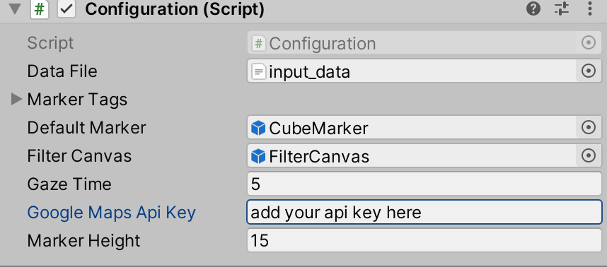

# Neighborhood DataVR
Unity asset for visualizing geo spatial data in Virtual Reality.

This tool brings localized, neighborhood data visualization into Unity. Content creators can easily create a 3D visualization of neighborhood-based data, such as local schools’ test scores or teacher-student ratios, in a mapped scene. 

## Components Involved:

- MapBox Unity SDK 1.2.0
- GoogleVR sdk 1.70.0

## API configuration:

This unity asset required API keys from Mapbox for rendering map and Google's geolocation API for geocoding address to latitude and longitude.

##### API Key can be obtained from here

Mapbox - https://www.mapbox.com/install/unity/

Google GeoLocation API Key -  https://developers.google.com/maps/documentation/geolocation

## Getting Started:
Once the API keys are obtained, they can be configured in the asset.

Open FilterScene from `Assets->Scenes->FilterScene`

Click on the GameObject named `Configuration` and in the Inspector panel under Scripts sections, you will find the text box named `Google Maps Api Key` and provide the Google Geo Location API Key here.

For adding mapbox API key, Choose `Mapbox->Configure` and provide the mapbox API key in the access token field and save it.

Geolocation data (preferably in .csv file) should be provided in the Data Field as mentioned below.
Drag and drop the file in the `Data File` field of the `Configuration` GameObject's inspector.

Next load MapScene from `Assets->Scenes->MapScene` and configure the initial location of data in the Map GameObject.

#### Configuration parameters

`Default Marker` - Field where the default marker's icon object should be placed.

`Marker Height` - Height of the markers over the buildings. Based on the data and location adjust the height of the markers.

`Gaze Time` - Maximum time that user should gaze so that click action is performed on the marker object.

`Data File` - Field where the CSV data file should be dragged and dropped.
              Code expects the CSV file to have the columns in the following order - Title, Type, Address, Contact Number, Website information. 

#### For changing markers displayed:

1. For changing the default marker, provide the suitable prefab in the Default Marker field of the Configuration game object.

3. For customizing different game objects for different types of markers
- First, provide the number of the different objects in the 'Size' field of the Configuration game object.
- Second, provide the name of the type and its corresponding prefab object that should be generated for this particular game object. If a particular type of marker is not defined here, then it will take the default game object. 

`Important: So it is advisable to never leave default marker field empty
`
